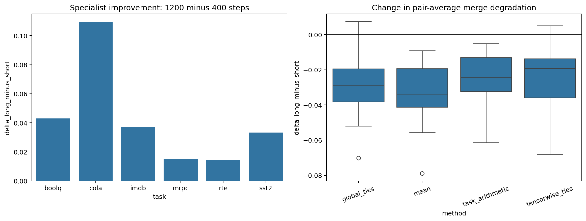
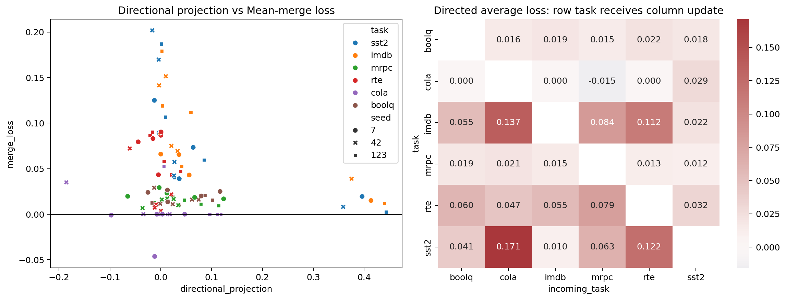

# Extended tasks, training budget, and directional interference

## Protocol and integrity

Notebook 10 extends the closed four-task study with CoLA and BoolQ. Frozen Mean, Task Arithmetic,
tensor-wise TIES, and global TIES configurations are evaluated at 400 optimizer steps on seeds 7,
42, and 123 with subset seed 2026. This gives 15 pairs per seed and 45 pair-seed units. A separate
seed-42 ablation compares 400 with 1200 steps on identical subsets. The bundle contains 480 unique
task-level merge evaluations, 60 pair diagnostics, 90 primary directional observations, 24
specialist scores, and no duplicate experimental rows.

## Primary method comparison

Across all 45 pair-seed units, average task-level score changes relative to the specialists are:

| Method | Mean score change | SD across pair-seed units | Worst task change |
|---|---:|---:|---:|
| Global TIES | -0.0295 | 0.0285 | -0.1227 |
| Tensor-wise TIES | -0.0306 | 0.0287 | -0.1870 |
| Task Arithmetic | -0.0380 | 0.0327 | -0.1869 |
| Mean | -0.0425 | 0.0305 | -0.2018 |

Tensor-wise TIES is best on 20 of the 45 pair-seed units, Task Arithmetic on 12, global TIES on 11,
and Mean on 2. Global TIES has the best aggregate mean and least severe observed task loss, but its
average advantage over tensor-wise TIES is small. The methods therefore remain a trade-off rather
than a universal ranking.

## CoLA validity limitation and sensitivity analysis

At 400 steps the CoLA specialist has Matthews correlation exactly 0.0 for every seed. It has not
learned a usable acceptability classifier, so ratio retention is undefined and pair results involving
CoLA cannot support a substantive merging claim. They remain in the complete tables for auditability.

Excluding every CoLA pair leaves five learned tasks, ten pairs per seed, and 30 pair-seed units:

| Method | Mean score change | SD | Worst task change |
|---|---:|---:|---:|
| Tensor-wise TIES | -0.0355 | 0.0270 | -0.1870 |
| Global TIES | -0.0388 | 0.0281 | -0.1227 |
| Task Arithmetic | -0.0409 | 0.0322 | -0.1495 |
| Mean | -0.0435 | 0.0230 | -0.1697 |

This sensitivity check preserves the earlier conclusion that TIES variants are stronger on average
than Mean, while reversing the very small ordering between the two TIES scopes. Claims about the
six-task aggregate must therefore always be paired with the no-CoLA result.

## Training-budget result

Longer training improves every seed-42 specialist:

| Task | 400 steps | 1200 steps | Change |
|---|---:|---:|---:|
| BoolQ | 0.6315 | 0.6745 | +0.0430 |
| CoLA (Matthews) | 0.0000 | 0.1095 | +0.1095 |
| IMDb | 0.7840 | 0.8210 | +0.0370 |
| MRPC (F1) | 0.8350 | 0.8498 | +0.0148 |
| RTE | 0.6065 | 0.6209 | +0.0144 |
| SST-2 | 0.7649 | 0.7982 | +0.0333 |

Despite these consistent specialist gains, pair-average merge degradation becomes more negative for
every method on average: global TIES by -0.0297, Mean by -0.0336, Task Arithmetic by -0.0252, and
tensor-wise TIES by -0.0245. This is a seed-42 ablation, not a multi-seed confirmation, but it supports
an important hypothesis: as specialists learn stronger and more distinct updates, they become harder
to combine with a single fixed merge rule.

## Directional diagnostics

The directional projection and incoming/source norm ratio were compared with task-specific Mean-merge
loss on 90 oriented observations. The projection-loss Pearson correlations are negative in all seeds
(-0.178, -0.110, and -0.379), but weak and not monotonic in seed 42. The norm-ratio correlations are
stronger and consistently negative (-0.704, -0.423, and -0.451). After excluding CoLA directions,
the pooled correlations with loss are -0.322 for directional projection and -0.441 for norm ratio.

These are exploratory associations, not a validated compatibility predictor. The heatmap is useful
because it exposes task asymmetry hidden by pair averages, but a directional metric should be tested
on held-out pairs before being used to choose a merge method.

## Frozen conclusion

The extension strengthens three conclusions. First, TIES-style conflict handling remains preferable
to simple averaging across a broader task set. Second, a larger training budget improves each
specialist but can increase the cost of forcing their updates into one encoder. Third, merge damage is
directional: the same pair can affect its two tasks very differently. The next justified experiment is
therefore not a broad hyperparameter search. It should test one pre-declared, task-direction-aware
scaling rule on stronger 1200-step specialists, using seed 42 for development and seeds 7 and 123 for
held-out confirmation.
