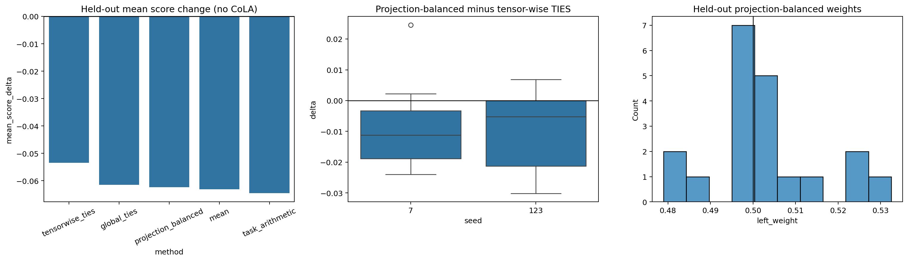

# Projection-balanced merging of long-trained specialists

## Protocol and integrity

Notebook 11 evaluates six task specialists trained for 1200 optimizer steps. Seed 42 is development
evidence; seeds 7 and 123 are held out. The four frozen baselines are compared with one deterministic
projection-balanced merge whose complementary weights are clipped to `[0.25, 0.75]`. The primary
comparison is against tensor-wise TIES on held-out pairs excluding CoLA. The bundle contains 450
unique task-level evaluations, 45 pairs, 90 directional observations, 45 weight assignments, and no
duplicate experimental rows.

## Specialist quality

At 1200 steps CoLA obtains non-zero Matthews correlation in every seed (0.143, 0.110, and 0.175 for
seeds 7, 42, and 123). The other held-out specialists are also stable: IMDb is approximately 0.82,
BoolQ 0.68, SST-2 0.80, MRPC F1 0.83-0.85, and RTE 0.61-0.62. The long-training experiment therefore
removes the failed-specialist limitation of the 400-step CoLA condition, although CoLA remains the
weakest specialist.

## Held-out method comparison

On the pre-declared held-out scope without CoLA (20 pair-seed units):

| Method | Mean score change | SD | Worst task change |
|---|---:|---:|---:|
| Tensor-wise TIES | -0.0534 | 0.0276 | -0.1435 |
| Global TIES | -0.0615 | 0.0314 | -0.1794 |
| Projection-balanced | -0.0624 | 0.0317 | -0.2255 |
| Mean | -0.0631 | 0.0308 | -0.2265 |
| Task Arithmetic | -0.0645 | 0.0407 | -0.2000 |

Tensor-wise TIES is best on 8 of 20 units, Task Arithmetic on 6, global TIES on 4, and Mean and
projection-balanced on one each.

Projection-balanced minus tensor-wise TIES has mean delta `-0.00894`, median `-0.00850`, and win
rate `25%`. Its bootstrap 95% interval is `[-0.01485, -0.00304]`, entirely below zero. The new method
also worsens the mean worst-task change by `-0.01837`. This is evidence that projection balancing is
inferior to tensor-wise TIES under the declared protocol.

Against global TIES, the mean delta is only `-0.00088`, with interval `[-0.01003, 0.00987]`; there is
no evidence of a meaningful difference between those two methods on average.

## Why the method did not help

The projection-derived left weights range only from `0.4790` to `0.5325`, with mean `0.5017`; none
reaches the clipping limits. The geometry therefore assigns almost equal weights to both task
vectors. Projection-balanced merging behaves nearly like Mean and inherits its inability to resolve
coordinate-level sign conflicts. Directional projection is useful descriptively, but converting it
into one scalar weight per task discards the local conflict information that TIES preserves.

The directional diagnostics nevertheless replicate on held-out long-trained specialists. Projection
versus Mean-merge loss has Pearson correlations `-0.480` and `-0.394` for seeds 7 and 123; the norm
ratio correlations are `-0.526` and `-0.559`. The corresponding Spearman directions are also
negative. Thus the diagnostic relationship generalizes better than the proposed correction.

## Frozen conclusion

Longer training produces viable specialists across all six tasks but increases the difficulty of
weight-space fusion. A global pair-level reweighting based on directional projections does not solve
that difficulty and is significantly worse than tensor-wise TIES on the primary held-out comparison.
The scientifically supported conclusion is that interference must be handled at finer granularity
than one scalar per task vector. This closes the experimental sequence: further method search after
observing these held-out results would add researcher degrees of freedom without a new independent
test set.
